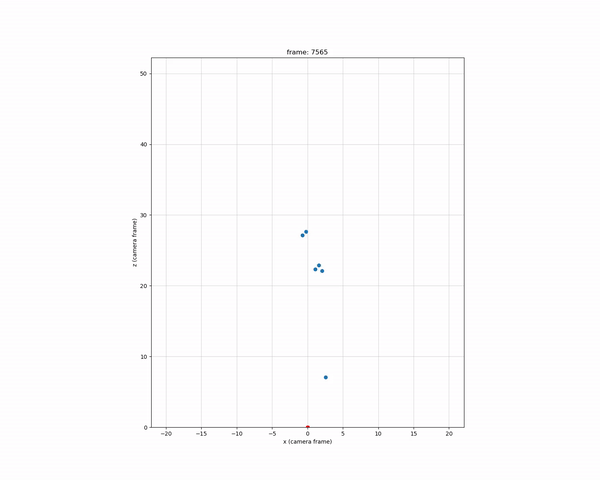

# Multi-Sensor Pedestrian Detection and 3D Localization

This repository contains a machine perception project for pedestrian detection and localization in an autonomous-driving setting.

The project combines **camera**, **LiDAR**, and **radar** data to detect pedestrians frame by frame, estimate their location in 3D, and visualize detections both in the camera image and in bird's-eye view (BEV).

---

## Demo

<p align="center">
  
  <br>
  <em>Frame-by-frame pedestrian detection using multi-sensor perception.</em>
</p>

<p align="center">
  
  <br>
  <em>BEV localization.</em>
</p>

---

## About

The goal of the project was to build a perception pipeline for detecting pedestrians around a self-driving vehicle.

The system processes LiDAR and radar point clouds to generate candidate 3D regions, projects these regions into the camera image, evaluates the resulting image patches with a CNN-based classifier, and returns final pedestrian detections after non-maximum suppression.

The resulting pipeline produces:

* 2D pedestrian bounding boxes in the camera image;
* 3D pedestrian localization from LiDAR/radar information;
* frame-by-frame pedestrian detection;
* BEV visualization of detected pedestrians.

---

## Method

The pipeline consists of four main stages:

1. **Point-cloud processing**
   LiDAR and radar points are filtered, regularized, and transformed into a structured representation.

2. **3D proposal generation**
   Point-cloud clusters are used to generate candidate 3D bounding boxes corresponding to possible pedestrians.

3. **Camera projection and CNN scoring**
   The 3D proposals are projected into the 2D camera image to extract image patches. A binary MobileNetV2 checkpoint supplied by the caller scores each patch.

4. **Post-processing**
   Non-maximum suppression is applied to remove redundant detections and retain the most confident pedestrian bounding boxes.

---

## Pipeline Overview

```text
LiDAR / Radar Point Clouds
        ↓
Filtering and Regularization
        ↓
Point-Cloud Clustering
        ↓
3D Bounding-Box Proposals
        ↓
Projection into Camera Image
        ↓
CNN-Based Patch Classification
        ↓
Non-Maximum Suppression
        ↓
2D Bounding Boxes + 3D / BEV Localization
```

---

## Results and Evaluation

The final system achieved frame-by-frame pedestrian detection and 3D localization using multi-sensor information from camera, LiDAR, and radar.

The main outputs are:

* pedestrian bounding boxes in the camera image;
* 3D pedestrian position estimates;
* bird's-eye-view localization;
* filtered final detections after non-maximum suppression (NMS).

### Image-Plane Evaluation

The projected 2D bounding boxes of the predicted 3D pedestrians were compared against ground-truth 2D pedestrian boxes using precision-recall curves, average precision (AP), and mean average precision (mAP).

At an IoU threshold of `0.2`, the detector achieved:

```text
AP@0.2 IoU: ~50%
Image-projection mAP: ~35%
```

The precision-recall curve showed high precision at low-to-moderate recall values, with precision remaining close to one up to roughly `0.4` recall. Recall was limited to about `0.6`, mainly because some pedestrians were occluded in the camera image or discarded during the LiDAR/radar proposal-generation stage.

### Bird's-Eye-View Evaluation

Since the task is fundamentally about 3D pedestrian localization, the detector was also evaluated in bird's-eye view using center-distance matching on the ground plane.

The BEV results were better than the image-plane IoU results, indicating that the system was often able to localize pedestrians reasonably well in 3D even when the projected 2D bounding box was not perfectly aligned with the ground truth.

### Qualitative Findings

The qualitative videos revealed several important failure modes:

* lower confidence thresholds improved recall but introduced more false positives;
* nearby or overlapping pedestrians could be merged into a single cluster;
* NMS sometimes suppressed valid nearby detections;
* reflections and visually similar structures occasionally produced false positives;
* non-flat road geometry, such as bridges, reduced the reliability of ground-plane removal;
* detections appeared and disappeared across frames because the pipeline processed each frame independently without temporal tracking.

Overall, the system demonstrated a functional multi-sensor pedestrian-detection pipeline, with stronger performance in 3D/BEV localization than in precise image-plane bounding-box alignment.

---

## Detailed Project Report

A full technical write-up is available in the [detailed project report](docs/project_report.pdf).

---

## Running the Pipeline

The source package is dataset-agnostic. Convert each synchronized observation into `SensorFrame`, then provide an independently trained binary MobileNetV2 checkpoint:

```python
from src import MultiSensorPedestrianDetector, SensorFrame, run_detector_on_sequence

frames: list[SensorFrame] = load_and_adapt_frames()
detector = MultiSensorPedestrianDetector(checkpoint_path="weights/pedestrian_mobilenet_v2.pt")
detections = run_detector_on_sequence(frames, detector)
```

`SensorFrame` contains the camera image, LiDAR and radar arrays, sensor transforms, projection matrix, and camera-frame ground plane required by the pipeline. Dataset loading intentionally remains outside this repository.

---

## Repository Structure

```text
.
├── README.md
├── requirements_libraries.txt
├── docs/
│   └── project_report.pdf
├── media/
│   ├── sequence_2.gif
│   ├── sequence_2.mp4
│   ├── sequence_bev_2.gif
│   ├── sequence_bev_2.mp4
│   └── sequence_bev_2_vertical.gif
├── src/
│   ├── README_SRC.md
│   ├── __init__.py
│   ├── bounding_boxes.py
│   ├── classifier.py
│   ├── config.py
│   ├── data.py
│   ├── evaluation.py
│   ├── nms.py
│   ├── pedestrian_detector.py
│   ├── point_cloud_processing.py
│   ├── run_sequence.py
│   ├── transforms.py
│   └── visualization.py
```

---

## Technologies Used

* Python
* NumPy
* OpenCV
* PyTorch
* LiDAR point-cloud processing
* Radar data processing
* CNN-based image classification
* Non-maximum suppression
* Bird's-eye-view visualization

---

## Key Skills Demonstrated

* Multi-sensor fusion for autonomous driving
* LiDAR and radar point-cloud processing
* 3D proposal generation
* Projection of 3D detections into the camera image
* CNN-based pedestrian classification
* Non-maximum suppression for redundant detection filtering
* Autonomous-driving perception pipeline design
* Visualization of 2D detections and 3D localization results
* Evaluation of perception systems using complementary 2D and 3D metrics, including precision-recall analysis, AP/mAP, IoU-based image-plane evaluation, BEV center-distance matching, and qualitative failure-mode analysis.

---

## Data and Media Notice

No source dataset, annotations, or trained weights are included. The retained demonstration media was produced from the View-of-Delft research dataset and remains governed by its original research-use license. Dataset credit: A. Palffy, E. Pool, S. Baratam, J. Kooij, and D. Gavrila, “Multi-Class Road User Detection With 3+1D Radar in the View-of-Delft Dataset,” IEEE Robotics and Automation Letters, 2022, DOI: [10.1109/LRA.2022.3147324](https://doi.org/10.1109/LRA.2022.3147324).

The source package does not grant rights to any separately obtained dataset or model checkpoint.
